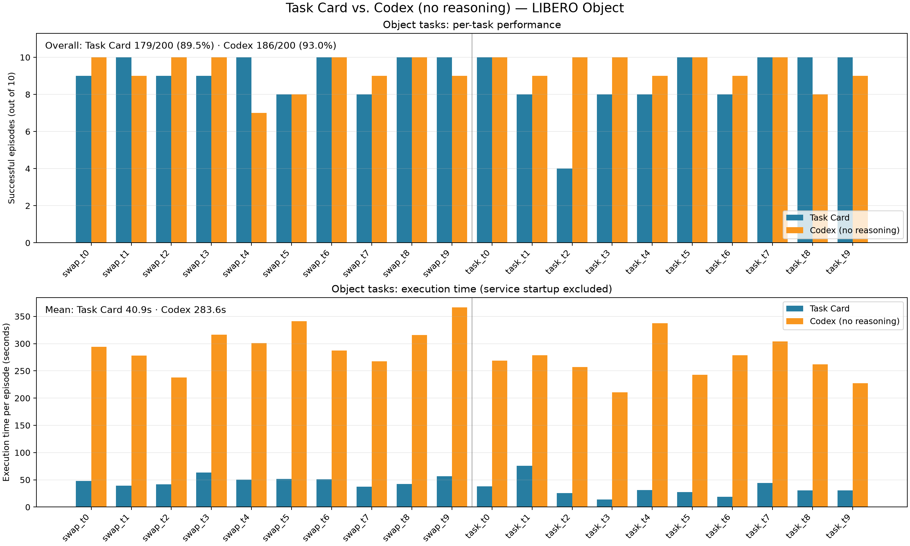

Task Cards
==========

A **task card** stores the action sequence for a LIBERO task and marks the key
objects or locations needed by those actions. During replay, RPent finds their
current coordinates in the camera images, updates the action coordinates, and
executes the recorded actions in order.

This keeps planning and perception separate:

1. The task card decides **what to do**.
2. SAM3 or Molmo finds **where to do it** in the current scene.
3. The LIBERO toolkit executes the actions at the updated coordinates.

``--planner task_card`` therefore does not call an LLM to make planning
decisions. Molmo is used only for visual localization: it points to a requested
object or location in a camera image so RPent can recover its current
coordinates.

Performance and execution time
------------------------------

On the 200 LIBERO Object evaluations (20 tasks and 10 seeds per task), Task
Card solved 179 episodes (89.5%), compared with 186 (93.0%) for Codex without
reasoning. Its mean execution time was 40.9 seconds per episode, compared with
283.6 seconds for Codex.

The timing excludes model and service startup. Codex time is the mean planner
execution time over the 10 evaluated seeds for each task. The original
10-seed Task Card timing logs are no longer available, so its timing bars use
the tool-execution time from the recorded episode underlying each final card
(one timing sample per task). The success rates use the complete 200-episode
evaluation in both cases.

How replay works
----------------

Each card contains an action plan and a set of anchors. An anchor describes a
task-relevant object or location, such as the object to pick or the destination
for a placement. Actions that depend on an anchor store their offset from that
anchor instead of relying only on an absolute coordinate.

At run time, RPent extracts the anchors required by the card and locates each
one with the interface recorded for it:

* **SAM3** locates segmentation anchors and returns an object mask and its
  position.
* **Molmo** locates point anchors by pointing to the requested object or
  location in the camera image.

RPent then combines each live anchor position with the offset stored in the
card and executes the resulting waypoint. This lets the same card run when
objects appear at different positions.

Task-card files
---------------

Task cards are distributed through the `RLinf/RPent-memory task-card directory
<https://huggingface.co/datasets/RLinf/RPent-memory/tree/main/libero/task_card>`_
on Hugging Face rather than tracked in Git. RPent downloads them with the other
LIBERO memory and stores them locally under ``memory/libero/task_card``.
There is one card for each supported task.

.. code-block:: text

   memory/libero/task_card/
     object_swap_t3_anchors.json   objects and locations to locate at run time
     object_swap_t3_plan.json      actions and their anchor-relative coordinates

The task selects the card. The seed changes the environment layout, not the
card used for the task.

To download only the task cards manually, run:

.. code-block:: bash

   hf download RLinf/RPent-memory --repo-type dataset \
     --include "libero/task_card/**" --local-dir memory

Run a task card
---------------

Start Molmo first, then pass its endpoint to RPent:

.. code-block:: bash

   rpent --robot libero --planner task_card \
     --suite libero_object_swap --task 3 --seed 0 \
     --molmo-endpoint http://127.0.0.1:20703

Task-card replay currently supports the ``libero_object_task`` and
``libero_object_swap`` suites. Other LIBERO suites do not yet have task cards.

The VLA and SAM3 services use the normal LIBERO runtime configuration. You can
also connect to services that are already running with ``--vla-endpoint`` and
``--sam3-endpoint``.

Molmo setup
-----------

Molmo requires a newer ``transformers`` version than the LIBERO policy
environment, so run it in a separate Python environment:

.. code-block:: bash

   uv venv --python 3.11 /path/to/molmo-venv
   /path/to/molmo-venv/bin/pip install -e ".[molmo]"

Download ``allenai/Molmo2-8B`` from `Hugging Face
<https://huggingface.co/allenai/Molmo2-8B>`_ or `ModelScope
<https://modelscope.cn/models/allenai/Molmo2-8B>`_, then start the service:

.. code-block:: bash

   export MOLMO_CHECKPOINT_PATH=/path/to/Molmo2-8B
   PYTHONPATH=/path/to/RPent /path/to/molmo-venv/bin/python \
     rpent/robots/components/molmo_server.py \
     --transport http --host 127.0.0.1 --port 20703

Replay multiple layouts
-----------------------

Run the same task card with different seeds to evaluate it on different
layouts. Reusing existing VLA, SAM3, and Molmo services avoids loading the
models again for every run:

.. code-block:: bash

   for seed in $(seq 0 9); do
     rpent --robot libero --planner task_card \
       --suite libero_object_swap --task 3 --seed "$seed" \
       --output-dir logs/sweep/swap_t3_s$seed \
       --vla-endpoint http://127.0.0.1:20701 \
       --sam3-endpoint http://127.0.0.1:20702 \
       --molmo-endpoint http://127.0.0.1:20703
   done
